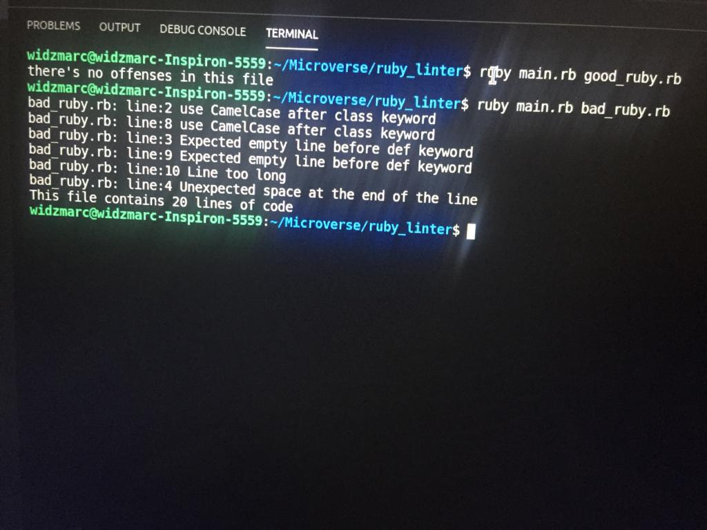
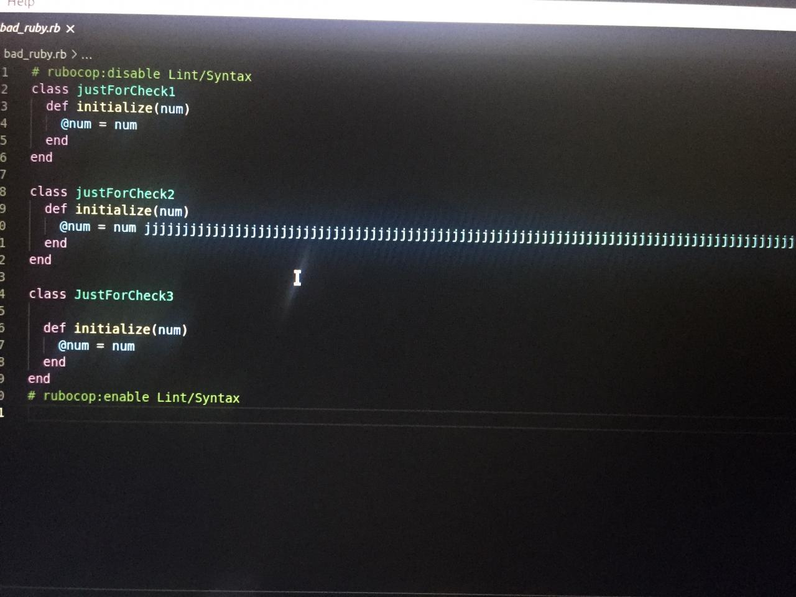
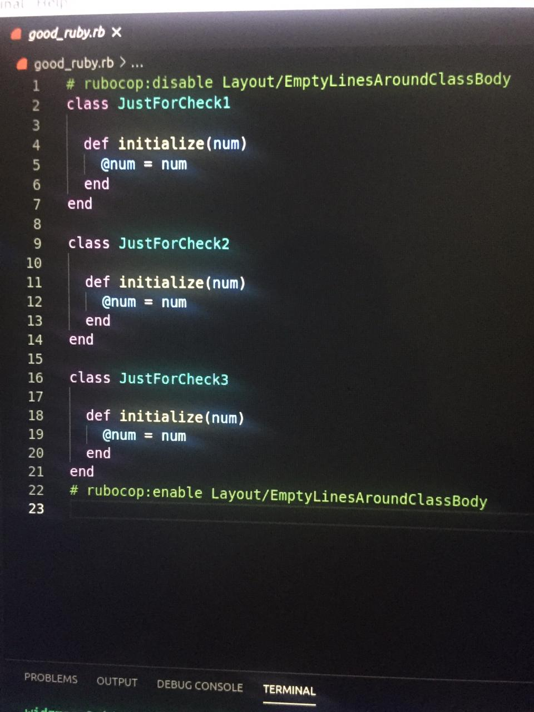

 # Tic-Tac-Toe

> A custom linter for ruby files! In this project, we passed an argument(file path) from the command line to our executable file and go through the file line by line to detect some predetermined ruby offenses.

# What this linter complain about:
- It expects a capitalized word After class keywords. 
- It expects an empty line before def keywords
- It expects a maximum length of 120 characters for each line.
- Complains if there's a trailing space at the end of a line

# Runnig App

# Bad Code

# Good Code

## Built With

- Ruby

## Getting Started

- Open the terminal command line.
- Clone the repo:--> git clone https://github.com/widzthedvloper/ruby_linter.git
- cd ruby_linter
- type ruby main.rb good_ruby.rb or ruby main.rb bad_ruby.rb to use the linter on those files in the repo or provide a path to your own ruby file.

## Authors

👤 **Widzmarc Jean Nesly Phelle**

- GitHub: [@widzthedvloper](https://github.com/widzthedvloper)
- Twitter: [@widzthedvloper](https://twitter.com/widzthedvloper)
- LinkedIn: [@widzthedvloper](https://www.linkedin.com/in/widzmarc-jean-nesly-phelle-252a26129/)

## 🤝 Contributing

Contributions, issues, and feature requests are welcome!

## Show your support

Give a ⭐️ if you like this project!

## 📝 License

This project is [MIT](/LICENSE) licensed.